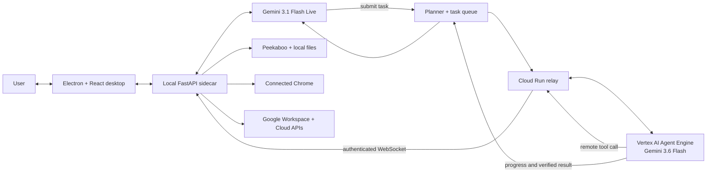

[](https://www.electronjs.org/)
[](https://ai.google.dev/gemini-api/docs/live)
[](https://google.github.io/adk-docs/)
[](https://cloud.google.com/vertex-ai/generative-ai/docs/agent-engine/overview)
[](https://cloud.google.com/run)
[](https://github.com/steipete/Peekaboo)
[](https://playwright.dev/)
[](https://workspace.google.com/)
[](https://fastapi.tiangolo.com/)
[](https://react.dev/)

# Sherpa

Sherpa is a macOS application for talking through work and handing off computer tasks. It combines a live voice and camera conversation with workers that can operate installed applications, the user's current Chrome session, local files, Google Workspace, and Google Cloud.

It is designed for requests that start as an outcome rather than a sequence of clicks. A user can say, “Open WhatsApp, find the conversation with Ben, and attach the latest proposal from Downloads.” Sherpa keeps that as one task: it finds the application, inspects the current interface, locates the file, works through the native file picker, and checks the resulting state.

The conversation does not stop while that work runs. The user can keep speaking, submit another request, change queued work, steer the active task, answer a question, or cancel a task. Sherpa reports progress and returns the result to the same conversation.

## What Sherpa does

Sherpa provides two connected parts of the same application:

- A realtime assistant that listens and speaks, supports interruption, transcribes the conversation, and can use optional camera frames when the user is showing it something.
- A task system that turns a spoken or typed request into visible, durable work with explicit state, progress, questions, and a verified result.

The realtime assistant handles the interaction. The task worker handles operations that may take several steps or change something outside the conversation. This allows Sherpa to answer a question immediately without treating every exchange as a computer task, and to carry out longer work without blocking the voice session.

### Work across applications

Sherpa can inspect and operate installed macOS applications. It can launch or focus an application, read accessible controls, select a window or dialog, use menus, click, type, scroll, press shortcuts, and handle supported open and save panels. It observes the interface again after meaningful changes instead of assuming that an earlier element or window is still valid.

This makes it possible to complete a request across several surfaces. A single task can find information in Gmail, download a file from Drive, inspect it locally, open a conversation in a native application, attach the file, and verify the attachment. The task remains organized around the requested outcome rather than being split into unrelated application-specific conversations.

### Use the browser that is already open

Sherpa connects to the user's existing Chrome session. It can inspect open tabs, read page structure, navigate, fill fields, select options, upload files, and verify visible changes. It does not create a separate browser profile just for the agent, so websites use the sessions the user has already connected.

### Work directly with Google Workspace

Sherpa uses connected Google Workspace APIs when direct access is clearer and more reliable than reproducing the same operation through a website. It can search and manage Gmail, organize Drive files, read and edit Docs, work with Sheets ranges and formulas, update Slides, inspect calendars and contacts, and use supported Tasks, Forms, and Meet operations.

Workspace activity appears in the task interface alongside native and browser work. When a result produces a file or document, that output can be passed to the next task rather than rediscovered from an open window.

### Manage visible tasks

Requests enter a task ledger instead of disappearing into the conversation. Tasks can be queued, running, blocked, completed, failed, or cancelled. The interface shows the current instruction, updates from the worker, application or Workspace previews where available, questions that need an answer, and the final result.

Sherpa compares new requests with work that already exists. It can create a new task, reuse an existing one, revise queued work, steer a running task, or cancel work. A task can also depend on a named output from an earlier task.

Running computer work is currently sequential because one Mac has one pointer, keyboard focus, clipboard, and set of modal dialogs. Requests can still be discussed, admitted, updated, and queued while another task controls the foreground interface.

### Remember useful context

Each signed-in local profile has separate memory, permissions, skills, and task context. Sherpa can retain bounded information such as preferences, project facts, and reusable workflows while excluding credentials and temporary interface state. The user can turn learning off, edit eligible memory, or delete it.

### See and capture what the user shows it

The optional camera feed gives the live conversation visual context. Sherpa can discuss an object in view or capture a still frame from the existing live feed. A captured image is saved locally and shown in the interface. Capturing a photo does not authorize Sherpa to send, upload, or otherwise use it; that requires confirmation.

## How Sherpa works

Sherpa separates live conversation from tool-driven execution and keeps device-bound tools on the user's Mac.

`gemini-3.1-flash-live-preview` listens, speaks, handles interruptions, understands live camera context, and accepts immediate voice actions. Requests that require software operation are handed to a Google ADK task runner. A `gemini-3.6-flash` planner maintains the ordered task queue, and a deployed `gemini-3.6-flash` worker discovers the tools it needs, performs the task, and reports evidence back to the voice session.



The live model does not wait inside a long application operation. It submits the task, keeps the conversation available, and receives task updates asynchronously.

The interface, voice bridge, account state, credentials, and real tool implementations run locally. The execution worker runs in Vertex AI Agent Engine. Cloud Run connects the worker to the correct desktop through an authenticated relay, preserving the original tool schemas while keeping native access on the device.

For the complete system and agent diagrams, see [System Architecture](Architecture.md) and [Agent Architecture](AgentArchitecture.md).

## Google Cloud deployment

Sherpa currently uses Google Cloud project `sherpa-20260813`:

| Service | Deployment | Responsibility |
|---|---|---|
| Vertex AI Agent Engine | `Sherpa Agent` in `europe-west1` | Hosts the deployed Google ADK execution worker and its sessions |
| Cloud Run | `sherpa-relay` in `africa-south1` | Streams Agent Engine requests and correlates remote tool calls with the connected Mac |
| Vertex AI | Global model location | Serves the task execution model |
| Secret Manager | `sherpa-internal-secret` | Supplies relay authentication to Cloud Run and Agent Engine |
| Artifact Registry | `sherpa` repository in `africa-south1` | Stores the relay container image |
| Cloud Build | Project build service | Builds the relay image before Cloud Run deployment |

The Cloud Run service is not the entire Sherpa backend. The packaged FastAPI sidecar stays on the Mac because microphone audio, camera capture, Keychain, Chrome, local files, macOS permissions, and native application control cannot be moved into a cloud container.

The desktop creates a device identity once and stores it in macOS Keychain. It then maintains a persistent outbound WebSocket to Cloud Run. Agent Engine calls remote tool declarations through the relay; the local dispatcher resolves the real tool, checks the active account and permissions, executes it on the Mac, and returns the structured result to the worker.

The deployment definitions live in `infra/deploy_relay.sh`, `infra/cloudbuild.relay.yaml`, and `infra/deploy_agent_engine.py`.

## Accounts and local data

Sherpa opens with a create-account or sign-in screen. A local demo profile can also be filled automatically. Signing in selects an isolated local profile; the account menu in the main interface shows the active account and supports sign-out.

- Accounts and hashed session tokens are stored locally in `accounts.sqlite3`.
- Passwords are stored as salted hashes, never plaintext.
- Memory, personalization, skills, and application permissions are separated by account ID under `~/Library/Application Support/Sherpa/profiles/`.
- Gemini credentials, Google OAuth tokens, the Playwright connection token, and the relay device identity use macOS Keychain.
- The signed-in account ID is included in Agent Engine state and relayed tool calls. Both the relay and local dispatcher reject account mismatches.

This login system separates users on one Sherpa installation; it is not a cloud identity provider or a shared hosted account database.

## Native macOS control

Sherpa operates installed applications through a project-specific Peekaboo MCP runtime. It can:

- Find, launch, focus, and inspect installed applications.
- Read accessible interface controls and select exact windows, sheets, and dialogs.
- Click, type, press shortcuts, scroll, use menus, and perform supported accessibility actions.
- Select local files through native open and save panels.
- Re-observe an interface after each meaningful transition and discard stale element references.
- Keep application access behind explicit Mac and per-application permissions.

Native operations are verified against the current application state. Sherpa does not silently replace a requested Mac application with its web version.

## Browser workflows

Sherpa connects to the user's existing Chrome session through Playwright MCP. It can inspect tabs and page structure, navigate, click, type, select, upload, and verify visible results without opening a separate browser identity.

For repetitive page work, the execution agent can use a bounded DOM operation instead of performing a long series of individual clicks. Authentication, consequential submissions, uploads, and other sensitive actions remain explicit tool operations.

## Google Workspace

Connected Workspace tools give Sherpa direct API access to:

- Gmail for search, reading, drafts, replies, forwarding, sending, labels, and attachments.
- Drive for file discovery, upload, download, sharing, folders, comments, and organization.
- Docs for structured reading and editing.
- Sheets for ranges, rows, formulas, structure, and formatting.
- Slides for presentation inspection and batch updates.
- Calendar and Contacts for availability, attendees, events, and meeting links.
- Tasks, Forms, and Meet for task lists, surveys, responses, conferences, participants, recordings, and transcripts.

Sherpa uses these APIs directly instead of manually reproducing the same work in a browser.

## Dynamic tool discovery

Workers do not receive the complete tool catalog on every model turn. Skills preload likely namespaces, and the worker begins with a compact directory plus one loading operation:

```text
load_tools(tool_ids)
```

The worker loads only the relevant namespace schemas. A WhatsApp task can begin with native computer control while a spreadsheet task can begin with Sheets and Drive rather than receiving every available tool.

The worker can load another namespace at any point. Skills provide task-specific operating guidance; they do not lock or hide the rest of the registry.

## Voice, camera, and photos

Sherpa's live session supports continuous speech, interruption, transcripts, and optional camera context. The camera can help answer questions about an object the user is showing without continuously narrating the feed.

When asked to capture a photo, Sherpa takes a frame from the live camera, plays a shutter sound, saves the image locally, and places a preview in the voice interface. The user can expand, collapse, or dismiss the preview. Sherpa asks for confirmation before it submits any task that sends, uploads, or otherwise uses the saved image.

## Tasks, progress, and memory

Application work runs as ordered tasks outside the realtime voice loop. A planner can create, update, steer, reuse, or cancel work while preserving one clear task history. Workers publish concise progress to the interface and finish with a structured result containing a summary, evidence, and concrete outputs.

Tasks can pause for a focused user question and resume in the same session. Dependencies pass verified outputs forward instead of forcing later work to rediscover them from open windows.

Sherpa also supports account-local memory. A memory agent extracts bounded durable identity, preference, project, and workflow candidates while excluding credentials and transient application state. Users can disable learning, edit eligible memories, or delete them. An execution worker can also save a verified fact or reusable method when the user explicitly asks it to remember something from the current task.

Long ADK sessions use event compaction at 300,000 prompt tokens, retaining the latest 20 events while summarizing older context. Compaction manages one active task session; it is separate from durable cross-conversation memory.

## Permissions

The Connections interface keeps access visible and separately controllable for:

- Gemini models
- macOS screen inspection and application control
- individual installed applications
- Chrome reading, interaction, and tab management
- Google Workspace products
- Google Cloud resources and operations

Unavailable or disabled capabilities fail visibly. Tool discovery does not bypass operating-system permissions, application permissions, or Google account authorization.

## Models and services

| Capability | Model or service |
|---|---|
| Realtime voice and camera conversation | `gemini-3.1-flash-live-preview` |
| Task planning, execution, memory, and compaction | Google ADK with `gemini-3.6-flash` |
| Deployed execution runtime | Vertex AI Agent Engine |
| Device-to-agent bridge | Cloud Run authenticated relay |
| Native macOS automation | Peekaboo MCP, Accessibility APIs, and native input |
| Live camera window capture | ScreenCaptureKit native helper |
| Browser operation | Playwright MCP connected to Chrome |
| Workspace operations | Google Workspace APIs |
| Cloud operations | Google Cloud MCP services |
| Desktop application | Electron, React, TypeScript, and Vite |
| Local voice, accounts, orchestration, and tools | FastAPI and Python |
| Local state and credentials | SQLite and macOS Keychain |

## Repository structure

```text
sherpa/
├── src/                         # Desktop interface, voice UI, tasks, and camera preview
├── electron/                    # Electron windows, overlays, and native process wiring
├── backend/
│   ├── agents/                  # Voice, planner, execution, and memory agents
│   ├── skills/                  # Browser, native app, Workspace, and Cloud procedures
│   ├── tools/                   # Computer, browser, Workspace, Cloud, and voice tools
│   ├── sherpa_tasks.py          # Ordered task execution and event delivery
│   └── tool_registry.py         # Runtime capability search and leaf tool loading
├── cloud/relay/                 # Cloud Run device and Agent Engine bridge
├── infra/                       # Cloud Build, Cloud Run, and Agent Engine deployment
├── native/                      # ScreenCaptureKit camera-window capture helper
├── peekaboo-sherpa/             # Sherpa's Peekaboo macOS automation runtime
├── public/                      # Interface assets, sounds, and desktop pet assets
└── tests/                       # Backend behavior and tool-policy tests
```

## Local setup

Install frontend dependencies:

```bash
pnpm install
```

Run the FastAPI backend from the project root:

```bash
backend/.venv/bin/uvicorn backend.main:app --reload
```

Run the Electron application in another terminal:

```bash
pnpm dev
```

Sherpa requires a configured Gemini API key. Native application control also requires macOS Accessibility permission, and camera/window capture requires Screen Recording permission. Chrome and Google Workspace capabilities become available after their respective connections are enabled in the application.

Google Workspace OAuth requires `SHERPA_GOOGLE_CLIENT_ID` and `SHERPA_GOOGLE_CLIENT_SECRET`. Cloud execution uses the values documented in `backend/cloud.env.example`, plus the deployed relay and Agent Engine resources. Keep real credentials in local environment files, Keychain, or Google Secret Manager; do not commit them.

Build the desktop application and native capture helper with:

```bash
pnpm build
```

Build the complete arm64 macOS distribution with:

```bash
pnpm package:mac
```

## Testing instructions

### Automated verification

From a clean checkout on an Apple silicon Mac, install the frontend and backend dependencies:

```bash
pnpm install
python3 -m venv backend/.venv
backend/.venv/bin/pip install -r backend/requirements.txt
```

Run the complete deterministic backend test suite, TypeScript checks, and production build:

```bash
backend/.venv/bin/python -m unittest discover -s tests -v
pnpm typecheck
pnpm build
```

The backend suite covers accounts and profile isolation, dynamic tool loading, permission boundaries, browser and native-tool outcomes, sequential task scheduling, steering, task-result verification, explicit memory, ADK compaction, voice notifications, photo capture, Google Workspace request construction, and Cloud Run relay authentication.

### Manual smoke test

Requirements:

- An Apple silicon Mac running macOS.
- A Gemini API key for the realtime voice and local planner.
- Microphone permission for voice.
- Camera permission for live visual context and photo capture.
- Accessibility permission for native application control.
- Screen Recording permission for task previews and window capture.
- Network access to Gemini, Cloud Run, and Vertex AI.

1. Download [`Sherpa-0.1.0-arm64.dmg`](https://github.com/victorbash400/Sherpa/releases/download/v0.1.0/Sherpa-0.1.0-arm64.dmg).
2. Drag Sherpa into Applications. If the build is not notarized, Control-click Sherpa, choose **Open**, and confirm once.
3. Store the Gemini API key in the macOS Keychain entry read by Sherpa:

   ```zsh
   read -s "sherpa_key?Gemini API key: "
   security add-generic-password -U -a "$USER" -s "Sherpa Gemini API" -w "$sherpa_key"
   unset sherpa_key
   ```

4. Choose **Use demo account**, then select **Sign in**. This creates an isolated local demo profile; it does not connect to the developer's personal accounts.
5. Start the voice session and say: **“Open Calculator and calculate 125 times 8.”**
6. While the task is running, continue speaking to Sherpa or ask: **“What tasks are active?”** The conversation remains available while the worker operates separately.
7. Open the Tasks view. Confirm that the task moves through explicit state and completes only after Calculator visibly shows `1,000`.
8. Start another voice request and say: **“Take a photo.”** Confirm that Sherpa captures a local frame and displays its preview. Sherpa should ask before using that photo in another task.
9. Open the account menu and sign out. Create another account or sign back into the demo account to confirm that account-specific memory, settings, permissions, and sessions are separated.

The native task exercises the deployed path:

```text
Sherpa desktop
    → local FastAPI task manager
    → Cloud Run relay
    → Vertex AI Agent Engine worker
    → Cloud Run remote tool call
    → device-local macOS tool
    → verified result returned to Sherpa
```

The relay health endpoint is [`https://sherpa-relay-zjani637rq-bq.a.run.app/health`](https://sherpa-relay-zjani637rq-bq.a.run.app/health). A successful response confirms the Cloud Run bridge is reachable; the completed Calculator task verifies the full round trip through Agent Engine and the device-local tool boundary.

Google Workspace tests additionally require a configured Google OAuth client and a Google account allowed by its consent screen. Chrome tasks require the Sherpa Playwright connection to be enabled. These optional connections are not required for the Calculator, voice, camera, account, or cloud-relay smoke tests above.

---

Built for the All Things Agentic Hackathon.
