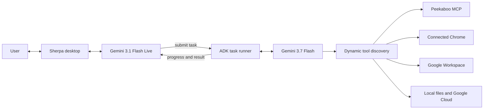

[](https://www.electronjs.org/)
[](https://react.dev/)
[](https://fastapi.tiangolo.com/)
[](https://google.github.io/adk-docs/)
[](https://ai.google.dev/gemini-api/docs/live)
[](https://github.com/steipete/Peekaboo)
[](https://playwright.dev/)
[](https://workspace.google.com/)

# Sherpa

Sherpa is a voice-first desktop agent for macOS. You can talk to it while you work, show it something through the live camera, and ask it to complete tasks across native applications, Chrome, Google Workspace, local files, and Google Cloud.

The voice conversation stays responsive while a separate execution agent handles longer work. Sherpa shows active tasks, reports verified progress, asks when it genuinely needs input, and returns results to the same conversation when the work is complete.

## How Sherpa works

Sherpa separates live conversation from tool-driven execution.

`gemini-3.1-flash-live-preview` listens, speaks, handles interruptions, understands live camera context, and accepts immediate voice actions. Requests that require software operation are handed to a Google ADK task runner. A `gemini-3.7-flash` worker then plans the work, discovers the tools it needs, performs the task, and reports evidence back to the voice session.



The live model does not wait inside a long application operation. It submits the task, keeps the conversation available, and receives task updates asynchronously.

## Native macOS control

Sherpa operates installed applications through a project-specific Peekaboo MCP runtime. It can:

- Find, launch, focus, and inspect installed applications.
- Read accessible interface controls and select exact windows, sheets, and dialogs.
- Click, type, press shortcuts, scroll, use menus, and perform supported accessibility actions.
- Select local files through native open and save panels.
- Re-observe an interface after each meaningful transition and discard stale element references.
- Keep application access behind explicit Mac and per-application permissions.

Native operations are verified against the current application state. Sherpa does not silently replace a requested Mac application with its web version.

## Browser workflows

Sherpa connects to the user's existing Chrome session through Playwright MCP. It can inspect tabs and page structure, navigate, click, type, select, upload, and verify visible results without opening a separate browser identity.

For repetitive page work, the execution agent can use a bounded DOM operation instead of performing a long series of individual clicks. Authentication, consequential submissions, uploads, and other sensitive actions remain explicit tool operations.

## Google Workspace

Connected Workspace tools give Sherpa direct API access to:

- Gmail for search, reading, drafts, replies, forwarding, sending, labels, and attachments.
- Drive for file discovery, upload, download, sharing, folders, comments, and organization.
- Docs for structured reading and editing.
- Sheets for ranges, rows, formulas, structure, and formatting.
- Slides for presentation inspection and batch updates.
- Calendar and Contacts for availability, attendees, events, and meeting links.
- Tasks, Forms, and Meet for task lists, surveys, responses, conferences, participants, recordings, and transcripts.

Sherpa uses these APIs directly instead of manually reproducing the same work in a browser.

## Dynamic tool discovery

Workers do not receive the complete tool catalog on every model turn. They begin with a compact registry and two discovery operations:

```text
search_tools(query)
load_tools(tool_ids)
```

The worker searches by intent and loads only the relevant schemas. Computer control is retrieved at leaf level, so a WhatsApp attachment task can load only application discovery, UI inspection, clicking, and native file-dialog handling rather than every available desktop command.

The worker can search again and add another tool at any point. Skills provide task-specific operating guidance; they do not lock or hide the rest of the registry.

## Voice, camera, and photos

Sherpa's live session supports continuous speech, interruption, transcripts, and optional camera context. The camera can help answer questions about an object the user is showing without continuously narrating the feed.

When asked to capture a photo, Sherpa takes a frame from the live camera, plays a shutter sound, saves the image locally, and places a preview in the voice interface. The user can expand, collapse, or dismiss the preview. Sherpa asks for confirmation before it submits any task that sends, uploads, or otherwise uses the saved image.

## Tasks, progress, and memory

Application work runs as ordered tasks outside the realtime voice loop. A planner can create, update, steer, reuse, or cancel work while preserving one clear task history. Workers publish concise progress to the interface and finish with a structured result containing a summary, evidence, and concrete outputs.

Tasks can pause for a focused user question and resume in the same session. Dependencies pass verified outputs forward instead of forcing later work to rediscover them from open windows.

Sherpa also supports explicit memory. It saves a preference, fact, or learned workflow only when the user asks it to remember, and later supplies a compact relevant memory context to the agent.

## Permissions

The Connections interface keeps access visible and separately controllable for:

- Gemini models
- macOS screen inspection and application control
- individual installed applications
- Chrome reading, interaction, and tab management
- Google Workspace products
- Google Cloud resources and operations

Unavailable or disabled capabilities fail visibly. Tool discovery does not bypass operating-system permissions, application permissions, or Google account authorization.

## Models and services

| Capability | Model or service |
|---|---|
| Realtime voice and camera conversation | `gemini-3.1-flash-live-preview` |
| Task planning and execution | Google ADK with `gemini-3.7-flash` |
| Native macOS automation | Peekaboo MCP, Accessibility APIs, and native input |
| Live camera window capture | ScreenCaptureKit native helper |
| Browser operation | Playwright MCP connected to Chrome |
| Workspace operations | Google Workspace APIs |
| Cloud operations | Google Cloud MCP services |
| Desktop application | Electron, React, TypeScript, and Vite |
| Voice and task backend | FastAPI and Python |

## Repository structure

```text
sherpa/
├── src/                         # Desktop interface, voice UI, tasks, and camera preview
├── electron/                    # Electron windows, overlays, and native process wiring
├── backend/
│   ├── agents/                  # Voice, planner, execution, and memory agents
│   ├── skills/                  # Browser, native app, Workspace, and Cloud procedures
│   ├── tools/                   # Computer, browser, Workspace, Cloud, and voice tools
│   ├── sherpa_tasks.py          # Ordered task execution and event delivery
│   └── tool_registry.py         # Runtime capability search and leaf tool loading
├── native/                      # ScreenCaptureKit camera-window capture helper
├── peekaboo-sherpa/             # Sherpa's Peekaboo macOS automation runtime
├── public/                      # Interface assets, sounds, and desktop pet assets
└── tests/                       # Backend behavior and tool-policy tests
```

## Local setup

Install frontend dependencies:

```bash
pnpm install
```

Run the FastAPI backend from the project root:

```bash
backend/.venv/bin/uvicorn backend.main:app --reload
```

Run the Electron application in another terminal:

```bash
pnpm dev
```

Sherpa requires a configured Gemini API key. Native application control also requires macOS Accessibility permission, and camera/window capture requires Screen Recording permission. Chrome and Google Workspace capabilities become available after their respective connections are enabled in the application.

Build the desktop application and native capture helper with:

```bash
pnpm build
```
