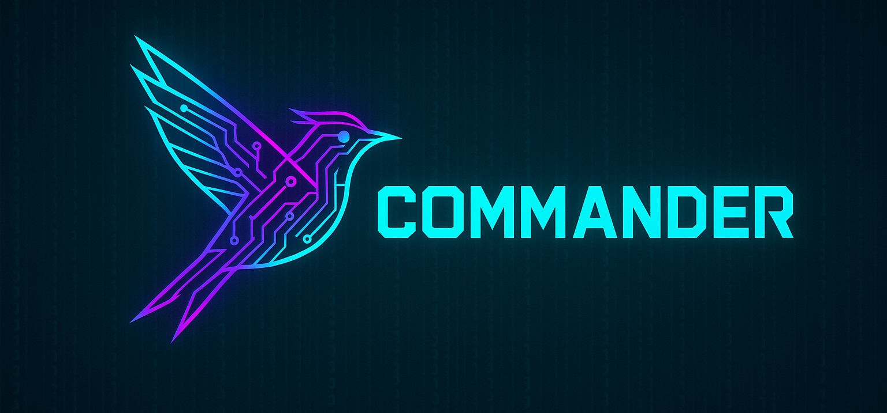

# Commander 🎛️ — Swift-first parsing, zero forks

<p align="center">
  
</p>

<p align="center">
  
  
  <a href="https://github.com/steipete/Commander/actions/workflows/ci.yml"></a>
  <a href="LICENSE"></a>
</p>

**Swift-first parsing. Total command over your CLI.**<br>
**One signature. Infinite tooling.**<br>
**All the ergonomics, none of the forks.**

Commander is Peekaboo's Swift-native command-line framework. It combines declarative property wrappers, a lightweight parser/router, and runtime helpers that integrate tightly with async/await + approachable concurrency.

**Platform story:** Commander targets the platforms we actively test: macOS, Linux, and Apple simulators (iOS/tvOS/watchOS/visionOS). Windows and Android builds are not supported or exercised in CI, so we no longer advertise them.

## Highlights

- **Property-wrapper ergonomics** – `@Option`, `@Argument`, `@Flag`, and `@OptionGroup` mirror the Swift Argument Parser API but simply register metadata. You keep writing declarative commands while Commander handles parsing and validation centrally.
- **Command signatures everywhere** – `CommandSignature` reflects every option/flag/argument so docs, help output, agent metadata, and tests all rely on the exact same definitions.
- **Source-of-truth metadata** – `CommandDescription` replaces the old ArgumentParser `CommandConfiguration`, giving us Commander-native builders for abstracts, discussions, versions, and subcommand trees.
- **Standard runtime options** – Every command gets `-v/--verbose`, `--json-output`, and `--log-level <trace|verbose|debug|info|warning|error|critical>` automatically so you can control logging without touching each command file.
- **Program router** – `Program.resolve(argv:)` walks the descriptor tree (root command → subcommand → default subcommand) and produces a `CommandInvocation` with parsed values and the fully-qualified path.
- **Binder APIs** – `CommanderCLIBinder` (living in PeekabooCLI) shows how to hydrate existing command structs by conforming them to `CommanderBindableCommand`. This keeps runtime logic untouched while swapping in Commander incrementally.
- **Approachable concurrency ready** – the package builds in Swift 6 language mode, with CI exercising Swift 6.3.3 so dependents get concurrency-checked APIs without an ArgumentParser compatibility shim.

## Getting Started

Add Commander as a local dependency (it currently lives in `/Commander` inside the Peekaboo repo):

```swift
// Package.swift
dependencies: [
    .package(path: "../Commander"),
    // ...
],
targets: [
    .executableTarget(
        name: "my-cli",
        dependencies: [
            .product(name: "Commander", package: "Commander")
        ]
    )
]
```

Then declare your command using the familiar property-wrapper style:

```swift
import Commander

@MainActor
struct ScreenshotCommand: ParsableCommand {
    @Argument(help: "Output path") var path: String
    @Option(help: "Target display index") var display: Int?
    @Flag(help: "Emit JSON output") var json = false

    static var commandDescription = CommandDescription(
        commandName: "capture",
        abstract: "Capture a screenshot"
    )

    mutating func run() async throws {
        // perform work…
    }
}
```

Then run it like any SwiftPM executable:

```bash
$ swift run capture --display 1 --json /tmp/screen.png
```

Commander handles `--help`, flag parsing, and error messages based on the metadata in your struct.

If you need more control over how parsed values reach your command type, conform to `CommanderBindableCommand` and use the helper APIs (`decodeOption`, `makeFocusOptions`, etc.). PeekabooCLI's window/agent commands are good examples.

By default the runtime injects the standard logging flags mentioned above; you can flip verbosity with `-v` or set an explicit level via `--log-level warning` (overrides environment variables like `PEEKABOO_LOG_LEVEL`).

### Command Metadata

Every `ParsableCommand` publishes a `CommandDescription`. The helper `MainActorCommandDescription.describe { ... }` builder keeps metadata construction on the main actor while staying nonisolated at the call-site:

```swift
@MainActor
struct AgentCommand: ParsableCommand {
    nonisolated(unsafe) static var commandDescription: CommandDescription {
        MainActorCommandDescription.describe {
            CommandDescription(
                commandName: "agent",
                abstract: "Run a Peekaboo automation agent",
                subcommands: [Serve.self, List.self],
                defaultSubcommand: Serve.self
            )
        }
    }
}
```

Commander caches these descriptions and feeds them to the router, `peekaboo learn`, and the documentation/export tooling, so the CLI, agents, and MCP metadata all stay in sync without an ArgumentParser compatibility shim.

## Documentation

Commander ships with a DocC catalog at `Sources/Commander/Commander.docc`. Generate the developer documentation (including the new articles) with:

```bash
swift package --disable-sandbox generate-documentation \
  --package-path Commander \
  --target Commander \
  --output-path .build/Commander.doccarchive \
  --transform-for-static-hosting \
  --hosting-base-path commander-docs
```

The resulting archive can be previewed locally in Xcode or hosted via GitHub Pages and Peekaboo's internal doc ingesters.

## Repository Layout

- `Sources/Commander` – Core types (property wrappers, tokenizer, parser, program descriptors, metadata helpers).
- `Tests/CommanderTests` – Unit tests for the parser/router, tokenizer edge cases, and `CommandDescription` metadata. Run them with `swift test --package-path Commander`.

## Options & Flags Support

Commander mirrors the ergonomics of Swift Argument Parser while keeping the parsing logic centralized. Key building blocks:

| Wrapper | Description | Notable Parameters |
| --- | --- | --- |
| `@Argument` | Positional values. Commander automatically enforces optionals/non-optionals and rejects excess values. | `help`, `parsing` (`singleValue`, `remaining`) |
| `@Option` | Named options (supports short, long, and custom spellings). Non-optional values without a default are required. | `name`, `names`, `parsing` (`singleValue`, `upToNextOption`, `remaining`) |
| `@Flag` | Boolean switches. Commander automatically wires both short & long spellings. | `name`, `names`, `help` |
| `@OptionGroup` | Reusable sets of options/flags (e.g., focus/window option structs). | – |

Every command automatically gets the standard runtime flags `--verbose` / `-v` and `--json-output`, courtesy of `CommandSignature.withStandardRuntimeFlags()`.

Need compatibility spellings (like `--json-output` alongside `--json`)? Use the alias helpers so Commander’s help output only shows the canonical names while the parser still accepts every variant:

```swift
let jsonFlag = FlagDefinition.make(
    label: "jsonOutput",
    names: [
        .short("j"),
        .long("json"),
        .aliasLong("json-output"),
        .aliasLong("jsonOutput")
    ],
    help: "Emit machine-readable JSON output"
)
```

`aliasLong` / `aliasShort` behave exactly like the regular cases during parsing, but Commander omits them from generated help text and metadata exports so your CLI docs stay concise. Keep every compatibility spelling on the same definition: separate argument, option, or flag definitions must have unique semantic labels, including definitions flattened from option groups.

`OptionParsingStrategy` mirrors the most common CLI behaviors:

- `singleValue`: exactly one argument follows the option (default).
- `upToNextOption`: consume all values until the next option/flag (perfect for `--include foo bar`).
- `remaining`: consume every raw token after the option, including option-looking values and `--`.

Positional arguments consume one token by default. Declare every required positional before the first optional positional so omitted values remain unambiguous. The final positional can opt into `@Argument(parsing: .remaining)` when a command intentionally accepts multiple values; all other commands reject trailing arguments instead of silently ignoring them.

Long options accept attached values such as `--output=-dash`. Short options only accept joined values when they opt in
explicitly, for example `@Option(name: .customShort("D", allowingJoined: true)) var define: String?` accepts `-Ddebug`.
Direct `OptionDefinition` and `FlagDefinition` values must declare at least one non-empty name, and every entry in
`joinedShortNames` must refer to a short spelling on that same option. Signature validation rejects unreachable metadata
before parsing, including long names containing `=` and the short name `-`, which are reserved for attached values and the
bare option terminator.

For advanced scenarios, `CommanderBindableValues` gives you helpers (`decodeOption`, `requireOption`, `makeWindowOptions`, etc.) so existing command types can conform to `CommanderBindableCommand` and hydrate themselves from parsed values without rewriting runtime logic.

## License

Commander is released under the MIT license. Refer to `LICENSE` for details.
