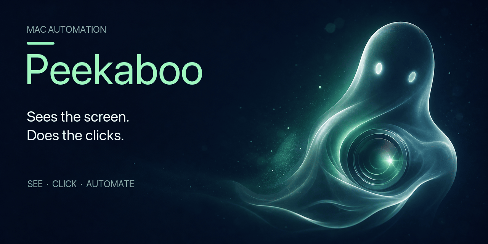

# Peekaboo 🫣 — Mac automation that sees the screen and does the clicks.

[](https://github.com/openclaw/Peekaboo/actions/workflows/macos-ci.yml) [](https://www.npmjs.com/package/@steipete/peekaboo) [](https://github.com/openclaw/Peekaboo/releases/latest) [](docs/platform-support.md) [](https://swift.org/) [](https://nodejs.org/) [](LICENSE) [](https://github.com/steipete/homebrew-tap) [](https://deepwiki.com/openclaw/Peekaboo)

Peekaboo is a macOS CLI and menu-bar app for screen capture, accessibility inspection, and native UI automation. Use it directly, let its agent plan multi-step work, or expose the same toolset to MCP clients.



## Install

The released CLI and app require macOS 15 or later.

### CLI with Homebrew

```sh
brew install steipete/tap/peekaboo
```

### MCP package with npm

The npm package requires Node.js 22 or later and includes the CLI plus its MCP launcher.

```sh
npx -y @steipete/peekaboo --version
```

See [MCP setup](docs/MCP.md) to connect it to Codex, Claude Code, Cursor, or another MCP client.

### Mac app

Download the signed DMG from the [latest GitHub release](https://github.com/openclaw/Peekaboo/releases/latest). The menu-bar app provides permission onboarding, visual feedback, and agent sessions; install the CLI separately when you also need `peekaboo` on `PATH`.

For source builds and alternative install details, see the [installation guide](docs/install.md).

## Quick start

Check the permissions available to Peekaboo, then take a screenshot:

```sh
peekaboo permissions status
peekaboo see --no-elements --mode screen --path /tmp/peekaboo-screen.png
```

Screen capture requires Screen Recording permission. Accessibility permission enables UI inspection and control; the [permissions guide](docs/permissions.md) covers setup and the additional permission used for synthetic input.

Inspect a running app to get a structured UI map with opaque element IDs:

```sh
peekaboo see --app Finder --json
```

That is the core loop: observe the current screen, choose an element from the result, and act on it.

## What's new in 4.2

Peekaboo 4.2 deepens background automation with exact, generation-bound receipts for browser
connections, dialogs, coordinate snapshots, and opaque web-view scrolling. These protocol upgrades
keep long-lived Bridge sessions pinned to the process, window, and semantic target they actually
validated, so stale or ambiguous work fails before dispatch instead of drifting to the active app.

## Automate an app

Target an element by its accessible label, then send text to the same app:

```sh
peekaboo click "Address and search bar" --app Safari
peekaboo type "github.com/openclaw/Peekaboo" --app Safari
peekaboo press Return --app Safari --foreground
```

Targeted semantic and typed input uses background delivery when Peekaboo can resolve the process, so the app does not have to become frontmost. Raw `press` chords always require explicit `--foreground`; prefer a semantic action such as `menu click` in background workflows. See the [automation guide](docs/automation.md) for element IDs, coordinates, snapshots, waits, and input behavior.

## Agent and MCP

The agent combines the same observation and action tools into a natural-language run:

```sh
peekaboo agent "Open Safari, go to github.com, and search for Peekaboo"
```

Agent runs need a configured model provider. See [agent setup](docs/commands/agent.md) for providers and sessions, or [MCP setup](docs/MCP.md) to expose Peekaboo's tools to another client.

## Command map

| Goal | Commands | Guide |
| --- | --- | --- |
| Observe the desktop | `see`, `screen list`, `window list` | [Capture and inspection](docs/quickstart.md) |
| Interact with UI | `click`, `type`, `press`, `scroll`, `drag`, `set-value`, `action` | [Automation](docs/automation.md) |
| Control macOS | `app`, `window`, `menu`, `menubar`, `dock`, `dialog`, `space` | [Command reference](docs/commands/README.md) |
| Run workflows | `agent`, `capture` | [Agent](docs/commands/agent.md) · [Capture](docs/commands/capture.md) |
| Integrate with clients | `mcp`, `browser`, `tools` | [MCP](docs/MCP.md) |

Run `peekaboo help <command>` for live CLI help. The [complete command index](docs/commands/README.md) links to flags, examples, and troubleshooting for every command.

## Configuration

Peekaboo stores provider credentials and settings under `~/.peekaboo`. Use `peekaboo config` to inspect or change them, and consult the [configuration guide](docs/configuration.md) for profiles, environment variables, and custom providers. The [provider reference](docs/providers.md) covers hosted, compatible, and local model backends.

Shell completions for zsh, bash, and fish come from `peekaboo completions`; see the [completion guide](docs/commands/completions.md) for persistent setup.

## Learn more

- [Project direction](VISION.md)
- [Platform support](docs/platform-support.md)
- [Architecture](docs/ARCHITECTURE.md)
- [Building from source](docs/building.md)
- [Testing](docs/testing/tools.md)
- [Agent chat loop](docs/agent-chat.md)
- [Command reference](docs/cli-command-reference.md)

## Community

- [PeekabooWin](https://github.com/FelixKruger/PeekabooWin) — Windows-first rewrite of the Peekaboo automation loop (JavaScript + PowerShell) by [@FelixKruger](https://github.com/FelixKruger)
- [PeekabooX](https://github.com/nordbyte/PeekabooX) — Linux-first rewrite of the Peekaboo automation loop (Rust + Python) by [@nordbyte](https://github.com/nordbyte)

## Development

Source builds require macOS 15 or later, Swift 6.2 or later, Node.js 22 or later, and the repository's submodules.

```sh
pnpm install --frozen-lockfile
pnpm run build:cli
pnpm run lint:docs
pnpm run test:safe
```

More build, signing, and test details live in [docs/building.md](docs/building.md).

## License

MIT. See [LICENSE](LICENSE).
