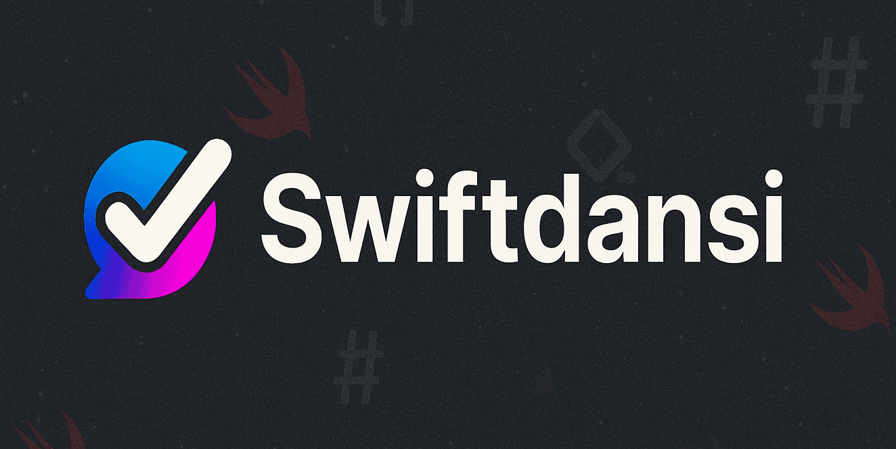

# Swiftdansi 🎨 — Give Markdown a terminal wardrobe.

[](https://github.com/steipete/Swiftdansi/actions/workflows/ci.yml)
[](https://github.com/steipete/Swiftdansi/releases/latest)
[](https://www.swift.org)
[](#platforms)
[](LICENSE)

<p align="center">
  
</p>

Swiftdansi is a Swift package and CLI that renders Markdown as ANSI-styled terminal output. It is for Swift apps and command-line tools that need wrapping, tables, code blocks, themes, or OSC 8 links.

## Install

Add Swiftdansi to your Swift package dependencies:

```swift
dependencies: [
    .package(url: "https://github.com/steipete/Swiftdansi.git", from: "0.3.0"),
]
```

Then add the library product to your target:

```swift
dependencies: [
    .product(name: "Swiftdansi", package: "Swiftdansi"),
]
```

## Quick start

```swift
import Swiftdansi

let markdown = "# Hello\n\nRender **Markdown** in your terminal."
let output = render(markdown, options: RenderOptions(width: 48))
print(output)
```

`render` detects terminal color, hyperlink support, and width unless you override them. Use `createRenderer(options:)` to reuse resolved options, or `strip(_:options:)` for plain text without ANSI or OSC sequences.

## Rendering controls

`RenderOptions` groups the renderer's behavior without changing the input Markdown:

| Area | Controls |
| --- | --- |
| Layout | wrapping, output width, list indentation, and quote prefixes |
| Tables | border style, padding, density, truncation, and ellipsis |
| Code | boxes, line-number gutters, wrapping, and a custom highlighter |
| Appearance | six built-in themes, custom themes, color, and OSC 8 hyperlinks |

See the [behavior and option reference](docs/spec.md) for the full rendering contract and the [DocC catalog](Sources/Swiftdansi/Swiftdansi.docc/Swiftdansi.md) for the public API.

## CLI

The package includes the `swiftdansi` executable. From a source checkout:

```sh
printf '# Hello **terminal**\n' | swift run swiftdansi --no-color
```

Input defaults to standard input and output defaults to standard output. Use `--in` and `--out` for files, and run `swift run swiftdansi --help` for the complete flag list. The [demo package](Examples/SwiftdansiCLI) shows a separate executable consuming the library.

## Platforms

The package requires Swift 6.2. `Package.swift` declares macOS 14, iOS 17, tvOS 17, watchOS 10, and visionOS 1; CI also builds and tests the library and CLI on Linux.

## Credits

Swiftdansi is a Swift port of [Markdansi](https://github.com/steipete/Markdansi), the original TypeScript implementation.

## Development

```sh
swift build
swift test
```

The repository also includes a VS Code development container with a pinned Swift toolchain for Linux development.

## License

[MIT](LICENSE)
