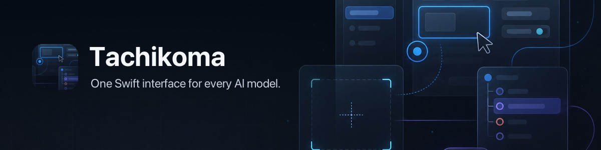

# Tachikoma 🕷️ — One Swift API, many models

<p align="center">
  
</p>

[](https://github.com/openclaw/Tachikoma/actions/workflows/ci.yml)
[](https://github.com/openclaw/Tachikoma/releases/latest)
[](https://swift.org)
[](Package.swift)
[](LICENSE)



Tachikoma is a Swift package for generating and streaming text, using vision and tools, and building realtime voice or agent workflows across hosted and local AI providers. It is for Swift applications that need one typed, concurrency-safe interface instead of provider-specific clients.

## Install

Add Tachikoma with Swift Package Manager:

```swift
platforms: [
    .macOS(.v14),
    .iOS(.v17),
],
dependencies: [
    .package(url: "https://github.com/openclaw/Tachikoma.git", from: "0.3.0"),
],
targets: [
    .target(name: "MyApp", dependencies: [
        .product(name: "Tachikoma", package: "Tachikoma"),
    ]),
]
```

Tachikoma requires Swift 6.2. Its declared Apple deployment targets are macOS 14, iOS 17, tvOS 17, watchOS 10, and visionOS 1; Linux builds are covered by CI.

## Quick start

Provide a credential for the model you select—`OPENAI_API_KEY` for this example—then generate a response:

```swift
import Tachikoma

let answer = try await generate(
    "Write a haiku about Swift.",
    using: .openai(.gpt55)
)
print(answer)
```

The convenience API resolves credentials from the environment or `TKAuthManager`. Network calls require access to the selected provider.

## Stream responses

`stream` returns an `AsyncThrowingStream` of provider-neutral text deltas:

```swift
import Tachikoma

let response = try await stream(
    "Explain actors in Swift.",
    using: .openai(.gpt55)
)

for try await delta in response {
    print(delta.content ?? "", terminator: "")
}
```

## Use tools

Define a typed tool and pass it to `generateText`. Tachikoma executes tool calls and feeds their results back to the model for up to `maxSteps` steps.

```swift
import Tachikoma

let add = createTool(
    name: "add",
    description: "Add two integers",
    parameters: [
        .init(name: "a", type: .integer, description: "First value"),
        .init(name: "b", type: .integer, description: "Second value"),
    ],
    required: ["a", "b"]
) { arguments in
    let a = try arguments.integerValue("a")
    let b = try arguments.integerValue("b")
    return AnyAgentToolValue(int: a + b)
}

let result = try await generateText(
    model: .openai(.gpt55),
    messages: [.user("Use the add tool for 123 + 456.")],
    tools: [add],
    maxSteps: 3
)
print(result.text)
```

## Choose a provider

The built-in catalog covers OpenAI, Anthropic, Google Gemini, xAI, MiniMax, Kimi, Mistral, Groq, Ollama, and LM Studio. Tachikoma also accepts custom OpenAI-compatible and Anthropic-compatible endpoints. See the [model catalog](docs/models.md) for current enum cases, model IDs, defaults, and provider notes.

Common hosted providers read these environment variables:

| Provider | Variable |
| --- | --- |
| OpenAI | `OPENAI_API_KEY` |
| Anthropic | `ANTHROPIC_API_KEY` |
| Google Gemini | `GEMINI_API_KEY` or `GOOGLE_API_KEY` |
| xAI | `X_AI_API_KEY`, `XAI_API_KEY`, or `GROK_API_KEY` |
| MiniMax | `MINIMAX_API_KEY` |
| Kimi | `MOONSHOT_API_KEY` or `KIMI_API_KEY` |

Use `TKAuthManager` when credentials should come from Tachikoma's stored profile instead. Hosts can change that profile root with `TachikomaConfiguration.profileDirectoryName`.

## Modules

The package separates optional surfaces so applications only link what they use:

| Product | Purpose |
| --- | --- |
| `Tachikoma` | Core models, generation, streaming, vision, and tools |
| `TachikomaAgent` | Conversations, sessions, and agent workflows |
| `TachikomaAudio` | Transcription, text-to-speech, and realtime audio |
| `TachikomaMCP` | Model Context Protocol integration |

Add an optional product beside `Tachikoma` in the target dependencies and import its module where needed.

## Documentation

- [Model catalog](docs/models.md)
- [Architecture](docs/ARCHITECTURE.md)
- [MCP integration](Sources/TachikomaMCP/README.md)
- [Realtime voice and Harmony](docs/openai-harmony.md)
- [Local models with LM Studio](docs/lmstudio.md)
- [Azure OpenAI](docs/azure.md)

## Development

```sh
git clone https://github.com/openclaw/Tachikoma.git
cd Tachikoma
swift build
TACHIKOMA_TEST_MODE=mock TACHIKOMA_DISABLE_API_TESTS=true swift test --parallel
```

See [CONTRIBUTING.md](CONTRIBUTING.md) for the contribution guide and [docs/testing.md](docs/testing.md) for test modes and provider integration tests.

## License

MIT. See [LICENSE](LICENSE).
